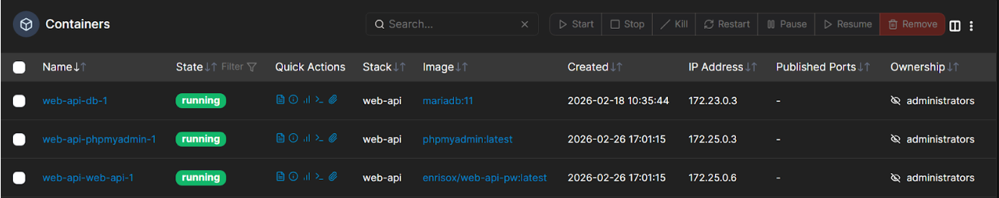

## Containerizzazione Docker

### Strategia di Containerizzazione e Orchestrazione
L'intero stack applicativo è isolato tramite Docker, garantendo portabilità e segregazione delle dipendenze. 

* **Docker Compose:** Utilizzato per definire e gestire il ciclo di vita dei multi-container (Web API, Database, Reverse Proxy). 
* **Portainer CE:** Implementato come interfaccia di gestione grafica per il monitoraggio in tempo reale di log, volumi e stato dei container, facilitando il troubleshooting senza esporre direttamente la CLI, oltre che per eseguire comandi da terminale dentro singoli container o eseguire azioni “pausa/start/stop/restart” sugli stessi se necessario. 
* **Network Isolation:** I servizi comunicano su una rete virtuale Docker interna (rp_net). Solo il Reverse Proxy è esposto verso l'esterno, agendo da unico gateway.

### Networking, Esposizione e Sicurezza Perimetrale 
L'accesso dall'esterno è regolato da una strategia a più livelli che combina offload cloud e hardening locale. 

#### Esposizione Pubblica (Edge) 
* **Cloudflare Protezione DDoS e WAF:** Agisce come primo scudo (L7/L3 Stack ISO/OSI). Implementa Bot Fight Mode, Browser Integrity Check e mitigazione DDoS. 
* **Mascheramento dell'IP e CDN + Caching Globale:** Memorizza i contenuti statici sui server Edge di Cloudflare, riducendo drasticamente il consumo di banda e il carico sul hardware locale.
* **Dynamic DNS (DDNS):** Un container dedicato sincronizza l'IP pubblico dinamico dell'host con i record DNS di Cloudflare, garantendo la continuità del servizio qualora cambi. 
* **Port Forwarding Selettivo:** Il router instrada esclusivamente le porte 80 (HTTP - redirect) e 443 (HTTPS) verso l'IP locale del Raspberry Pi. 

#### Reverse Proxy e TLS 
Come reverse proxy è stato scelto e implementato Caddy per la gestione automatica dei certificati TLS (con Let's Encrypt) e per la sua configurazione dichiarativa tramite Caddyfile. Gestisce la terminazione TLS e il routing interno verso i container.

```caddy
# Gestione del dominio principale per le Web-API 
web-api.enrisox-devops.it { 
    reverse_proxy web-api:6700
 } 

# Gestione del sottodominio per l'interfaccia database 
php.enrisox-devops.it {
    reverse_proxy phpmyadmin:80 
}
```

Il Caddyfile definisce le regole di instradamento e la gestione della sicurezza perimetrale a livello applicativo. Caddy agisce come unico punto d’ingresso (Gateway) per l'infrastruttura ospitata sul Raspberry Pi.

#### Gestione automatica del ciclo di vita TLS
Caddy automatizza interamente l'approvvigionamento e il rinnovo dei certificati SSL/TLS tramite le Certification Authority (CA) Let's Encrypt o ZeroSSL. 
* Ogni sottodominio dichiarato ottiene una connessione criptata conforme agli standard moderni (TLS 1.3). 
* Viene eseguito un reindirizzamento automatico (HTTP-to-HTTPS Redirection) per garantire che nessuna comunicazione avvenga in chiaro.

#### Risoluzione dei Nomi via Service Discovery (Docker) 
L'infrastruttura sfrutta il DNS interno di Docker. Le direttive reverse_proxy non puntano a indirizzi IP statici, ma agli hostname dei servizi definiti nel file di orchestrazione (es: web-api e phpmyadmin). 
Questo approccio garantisce: 
* **Resilienza:** Se un container viene ricreato con un nuovo IP interno, Caddy continua a raggiungerlo correttamente tramite il nome del servizio. 
* **Astrazione:** La configurazione del proxy rimane indipendente dalle variazioni della rete virtuale di Docker.

#### Terminazione TLS e Offloading 
Il carico computazionale relativo alla crittografia dei dati viene gestito interamente da Caddy (TLS Termination). In questo modo, i container a valle (Web-API e phpMyAdmin) possono elaborare le richieste senza l'overhead della gestione dei certificati, ottimizzando le risorse hardware limitate del Raspberry Pi. 

#### Segregazione dei Servizi tramite Sottodomini 
L'utilizzo di sottodomini distinti (web-api. e php.) permette di isolare logicamente i servizi. Sebbene risiedano sullo stesso hardware fisico, le API e il pannello di controllo del database sono esposti su endpoint differenti, facilitando l'applicazione di policy di sicurezza mirate (WAF, rate limiting) a livello di Cloudflare.

### Gestione Accessi e Hardening dell'Host 
La superficie d'attacco dell'host è ridotta al minimo tramite policy rigorose:
* **VPN Wireguard:** L'amministrazione remota avviene esclusivamente tramite tunnel criptato peer-to-peer. 
* **SSH Hardening:** * Autenticazione tramite password disabilitata (PasswordAuthentication no). 
    * Accesso consentito solo tramite chiavi SSH (Ed25519) autorizzate. 
* **Firewall (UFW):** Configurato in modalità "Default Deny", con apertura selettiva per il traffico Web e il traffico VPN/LAN locale. 
* **Intrusion Prevention:** Integrazione di Fail2ban e CrowdSec.
    * **Fail2ban:** È un software di sicurezza locale che monitora costantemente i file di log (come /var/log/auth.log) alla ricerca di ripetuti tentativi di accesso falliti tramite espressioni regolari. Quando rileva un comportamento sospetto, aggiunge automaticamente una regola al firewall di sistema(UFW) per bloccare temporaneamente l'IP dell'attaccante in una "prigione" (jail).
    * **CrowdSec:** È un sistema di prevenzione delle intrusioni moderno che analizza i log attraverso scenari comportamentali complessi e utilizza l'intelligenza collettiva globale. Oltre a bloccare gli attacchi locali, riceve in tempo reale una lista di IP malevoli segnalati da altri utenti della community, permettendo di prevenire le minacce prima ancora che tocchino il Raspberry Pi.

### Gestione Dati e Credenziali
* **Segretezza:** Utilizzo di GitHub Secrets per le variabili d'ambiente critiche nelle pipeline(es: credenziali Docker Hub) e nessuna password hardcoded nei Docker-compose, prediligendo sempre l’uso di variabili d’ambiente salvate sul server. 
* **Bitwarden come Password Manager:** Tutte le credenziali amministrative (es: Portainer, utenti Ubuntu server Raspberry) sono generate con alta entropia e archiviate solamente su password manager Bitwarden del SYS Admin.

### Architettura dei dati e gestione database 
Il cuore della persistenza dati è affidato a MariaDB, ottimizzato per l'ambiente containerizzato e protetto da una strategia di segregazione di rete. E’ stato scelto MariaDB per questioni di gestione risorse (poichè sul server ospitante il progetto vi sono svariati altri container in esecuzione), facilità di utilizzo e compatibilità alta con l’infrastruttura in questione.

#### Motore Database (MariaDB):
* Il container MariaDB è isolato all'interno della rete Docker interna (rp_net). 
* **Porta 3306 non esposta:** Il database non accetta connessioni dirette dall'esterno (WAN) né dall'host. È raggiungibile solo via socket di rete interna dagli altri container autorizzati (la Web-App Python e phpMyAdmin). 
* **Performance:** Configurato per operare su SSD esterno, garantendo tempi di latenza minimi per le query della Web-API. 

#### Pannello di Amministrazione (phpMyAdmin): 
* **Accessibilità:** Esposto tramite un sottodominio dedicato e gestito dal Caddyfile. 
* **Bridge di Comunicazione:** Agisce come unico punto di accesso grafico al database, traducendo le richieste HTTP in query verso il container MariaDB sulla rete protetta.
La connessione tra l'utente e phpMyAdmin è integralmente protetta da HTTPS fornito da Caddy, impedendo l'intercettazione delle credenziali (gestite tramite Bitwarden e condivise con tutto il team). 

Un punto di forza della configurazione è che l'applicazione Python non ha bisogno di conoscere l'indirizzo IP del container database. Grazie al DNS interno di Docker, la stringa di connessione punta semplicemente all'hostname del servizio definito nel docker-compose.yml. Questo approccio impedisce conflitti di rete e garantisce che, anche se i container vengono riavviati con nuovi IP interni, la comunicazione rimanga stabile e sicura.

### Analisi Tecnica e Misure di Sicurezza Dockerfile 

```dockerfile
FROM python:3.13-slim-bookworm

# Prevent Python from writing .pyc files and ensure immediate logging
ENV PYTHONDONTWRITEBYTECODE=1
ENV PYTHONUNBUFFERED=1

WORKDIR /app

# Update system to resolve OpenSSL and systemd CVEs
USER root
RUN apt-get update && \
    apt-get upgrade -y && \
    apt-get install -y --no-install-recommends libssl3 && \
    apt-get clean && \
    rm -rf /var/lib/apt/lists/*

# Create non-root user for improved security
RUN useradd -m -s /bin/bash appuser

# Upgrade pip and core build tools
RUN pip install --no-cache-dir --upgrade pip setuptools wheel

# Install dependencies (leveraging layer caching)
COPY requirements.txt .
RUN pip install --no-cache-dir -r requirements.txt && \
    pip install --no-cache-dir --upgrade gunicorn jaraco.context

# Copy source code and assign ownership
COPY --chown=appuser:appuser . .            

# Security: switch to non-root user
USER appuser                                     

EXPOSE 6700

# Use a flexible execution form for Gunicorn
CMD ["gunicorn", "--bind", "0.0.0.0:6700", "--workers", "2", "app:app"]
```

1.  **Immagine base leggera (Minimizzazione):** Utilizza python:3.13-slim-bookworm. La versione slim riduce drasticamente la superficie d'attacco eliminando pacchetti, librerie e binari non necessari che potrebbero contenere vulnerabilità. Meno codice c'è nell'immagine, meno punti di ingresso ha un attaccante. 
2.  **Patching tempestivo delle Vulnerabilità:** Il comando apt-get upgrade all'inizio del processo di build è fondamentale. Serve a correggere le CVE (Common Vulnerabilities and Exposures) note presenti nell'immagine base (come quelle di OpenSSL o systemd) prima che l'applicazione venga effettivamente installata. 
3.  **Principio del Privilegio Minimo (Non-Root User):** Questa è la misura di sicurezza più importante. Di default, i container girano come root; di conseguenza se un attaccante dovesse compromettere il container, avrebbe i permessi di amministratore sullo stesso, con tutte le ripercussioni del caso. Creando appuser e usando USER appuser, l'applicazione girerà con permessi limitati. Anche in caso di compromissione, l'attaccante non potrà installare pacchetti o modificare file di sistema. 
4.  **Ottimizzazione dei Layer e Pulizia:** * **Layer Caching:** Copiare prima il file requirements.txt permette a Docker di non reinstallare le librerie ogni volta che si modifica solo una riga di codice Python, velocizzando il deploy. 
    * **Pulizia Cache:** L'uso di --no-cache-dir per pip e la rimozione delle liste di apt (rm -rf /var/lib/apt/lists/*) mantiene l'immagine piccola e "pulita", evitando di portarsi dietro file temporanei inutili. 
5.  **Integrità del File System:** Il comando “COPY --chown=appuser:appuser . .” assicura che i file del codice appartengano all'utente limitato, garantendo che l'applicazione possa leggere ed eseguire il proprio codice senza necessitare di permessi elevati.

### Architettura e hardening della Sicurezza: Docker-compose

```yaml
version: "3.8"
services:
  db:
    image: mariadb:11
    # Ensure service restarts unless manually stopped
    restart: unless-stopped
    environment:
      MARIADB_DATABASE: webapi
      MARIADB_USER: webapi
      MARIADB_PASSWORD: ${DB_PASSWORD}
      MARIADB_ROOT_PASSWORD: ${DB_ROOT_PASSWORD}
    volumes:
      # Persistent storage for MariaDB data on the SSD
      - mariadb_data:/var/lib/mysql
    networks:
      # Isolated internal network for database traffic
      - backend

  web-api:
    image: enrisox/web-api-pw:${IMAGE_TAG:-latest}
    restart: unless-stopped
    # Enforce read-only filesystem for the container
    read_only: true
    expose:
      - "6700"
    # Pointing gunicorn socket to /tmp to prevent crashes on read-only FS
    command: >
      gunicorn app:app
      --bind 0.0.0.0:6700
      --control-socket unix:/tmp/gunicorn.ctl
      --log-level debug
      --access-logfile 
      --error-logfile 
      --capture-output
    environment:
      DB_HOST: db
      DB_NAME: webapi
      DB_USER: webapi
      DB_PASSWORD: ${DB_PASSWORD}
      APP_SECRET_KEY: ${APP_SECRET_KEY}
      ALLOWED_ORIGINS: "https://web-api.enrisox-devops.it"
    depends_on:
      - db
    networks:
      # Connection to reverse proxy and internal backend
      - rp_net
      - backend
    security_opt:
      # Prevent the container process from gaining new privileges
      - no-new-privileges:true
    cap_drop:
      # Drop all Linux capabilities to minimize attack surface
      - ALL
    tmpfs:
      # Mount writable temporary filesystems in RAM
      - /tmp:rw,noexec,nosuid,size=50m
      - /app/logs:rw,nosuid,size=50m

  phpmyadmin:
    image: phpmyadmin:latest
    restart: unless-stopped
    environment:
      PMA_HOST: db
      PMA_ARBITRARY: 0
      UPLOAD_LIMIT: 64M
    networks:
      - backend
      - rp_net
    expose:
      - "80"
    depends_on:
      - db
    deploy:
      # Limit memory usage for the administration panel
      resources:
        limits:
          memory: 256M

volumes:
  mariadb_data:

networks:
  backend:
    driver: bridge
  rp_net:
    # Existing network managed by the Caddy reverse proxy
    external: true
```

Questo file docker-compose.yml rappresenta una configurazione production-ready specifica per un ambiente Raspberry Pi, con un forte focus sul principio della **Defense in Depth**. 

1.  **Segregazione di rete (architettura a livelli):** Il sistema utilizza due reti distinte per isolare il traffico sensibile: 
    * **web-api_backend:** Una rete bridge privata. Il container MariaDB risiede esclusivamente qui. È fisicamente impossibile per il mondo esterno "vedere" la porta del database perché non è collegato alla rete del reverse proxy (rp_net). 
    * **rp_net:** Una rete esterna gestita dove opera Caddy. Solo la web-api e phpmyadmin sono collegati a questa rete per ricevere traffico legittimo. 
2.  **Hardening del Runtime (Strategia "Read-Only"):** La nostra applicazione implementa restrizioni di sicurezza restrittive per proteggere l'host: 
    * **read_only - true:** L'intero file system del container è bloccato in sola lettura. Anche se un attaccante sfruttasse una vulnerabilità nel codice Python, non potrebbe modificare il codice sorgente o iniettare script malevoli perché il disco è immutabile. 
    * **tmpfs:** Poiché Gunicorn e Python devono scrivere alcuni file temporanei (come socket o log), si scelto di utilizzare tmpfs. Questo crea cartelle scrivibili in RAM (non sul disco) che scompaiono all'arresto del container, non lasciando tracce persistenti di file temporanei. 
    * **no-new-privileges:** Questo flag impedisce ai processi del container di acquisire nuovi privilegi (privilege escalation), bloccando tentativi di ottenere l'accesso root. 
3.  **Rimozione delle Capability (cap_drop: ALL):** Il kernel Linux concede "capacità" speciali ai processi (come cambiare l'ora di sistema o gestire il networking a basso livello). Impostando ALL, la nostra app Python perde ogni potere amministrativo a livello di kernel: può solo eseguire il proprio codice e nient'altro, riducendo drasticamente la superficie d'attacco. 
4.  **Gestione Risorse e Persistenza:** * **Persistenza MariaDB:** Mappando mariadb_data su un volume esterno, i dati rimangono al sicuro sull'SSD anche se il container viene rimosso o aggiornato. 
    * **Limiti di Risorsa (RAM):** Abbiamo limitato phpmyadmin a 256MB. Su un Raspberry Pi questo è vitale per evitare che un singolo servizio "pesante" saturi la memoria causando il crash dell'intero sistema (OOM - Out of Memory). 
5.  **Gestione delle Variabili d'Ambiente attraverso Docker:** L'uso della sintassi ${VARIABLE} garantisce che i dati sensibili (password, chiavi segrete) non siano mai hardcoded nel file. Questi vengono invece richiamati da un file .env protetto (passato tramite Portainer durante creazione stack, seguendo le best practice DevSecOps.
