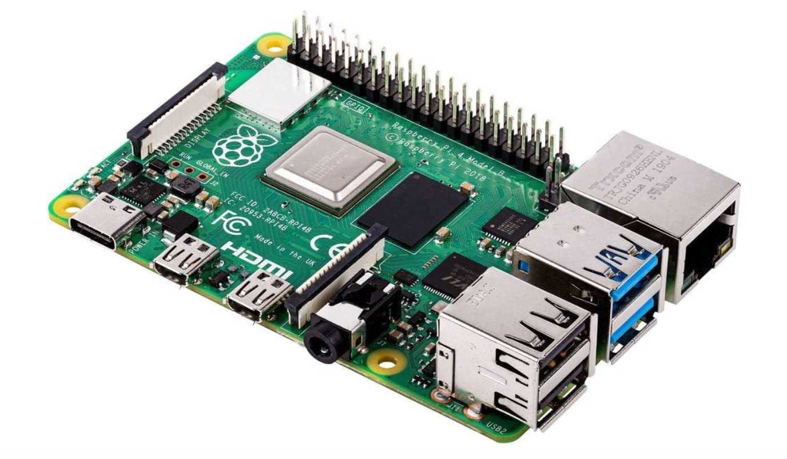

# Architettura Hardware e Sistema Ospite

L'infrastruttura si basa su un approccio **on-premises** ottimizzato per l'efficienza energetica e il rapporto performance/costi, utilizzando hardware ARM di ultima generazione.

- **Host**: Raspberry Pi 5.
- **CPU**: Quad-core ARM Cortex-A76 @ 2.4 GHz (architettura 64-bit).
- **RAM**: 8 GB LPDDR4X-4267 SDRAM.
- **Storage**: SSD SATA da 250 GB (tramite bridge USB 3.0/UASP) per garantire IOPS elevati e affidabilità superiore rispetto alle schede SD.
- **OS**: Ubuntu Server 24.04.4 LTS. La scelta della versione LTS garantisce stabilità a lungo termine e supporto per le patch di sicurezza e installa automaticamente di default gli aggiornamenti di sicurezza in background tramite “unattended-upgrades”; inoltre l'assenza di GUI minimizza l'overhead di sistema.

## Motivi della scelta: On-Premises vs Cloud solutions
- **Costo basso a lungo termine:** Investimento una tantum e nessun canone mensile. Un'istanza AWS equivalente costerebbe 50-60€/mese senza il piano Free, ammortizzando il Pi in meno di 3-4 mesi.
- **Controllo fisico completo su macchina e disco**: Accesso diretto all'hardware, storage SSD collegato nativamente, nessuna dipendenza da quote, policy o limiti imposti da provider terzi.
- **Latenza interna ridotta a zero**: La comunicazione tra container e tra servizi sulla LAN avviene senza passare per reti esterne, eliminando overhead di rete e costi di trasferimento dati tipici delle VPC cloud.
- **Cloudflare come edge proxy globale**: Compensa i limiti della connessione domestica agendo da scudo perimetrale: assorbe attacchi DDoS, filtra traffico malevolo tramite WAF, gestisce il caching e ottimizza la distribuzione del traffico a livello globale, senza costi aggiuntivi per il tier gratuito.
- **Efficienza energetica e sostenibilità ambientale**: Consumo medio di ~5W contro i costi energetici e ambientali di un'istanza cloud attiva h24. Ideale per un'infrastruttura always-on a basso impatto.
- **Ambiente realistico**: Gestire un server fisico, configurare networking reale, hardening dell'OS e orchestrazione container su hardware ARM riproduce fedelmente scenari enterprise on-premises, con un valore formativo diverso rispetto a un ambiente cloud gestito.

