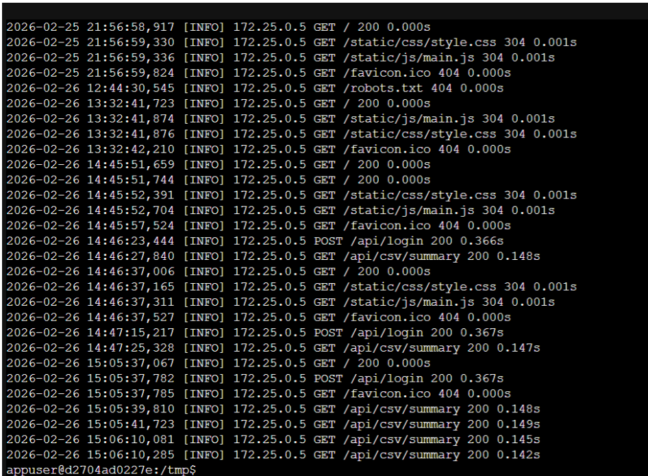

# Log e Test API con Pytest

Questa sezione illustra i componenti dedicati alla tracciabilità del traffico di rete tramite il **Middleware di Logging** e alla validazione dell'applicativo tramite la suite di test automatizzati (**Pytest**). Tali sistemi garantiscono la sicurezza, il monitoraggio delle performance e la stabilità dell'applicazione nel suo ciclo di vita.

### Middleware di Logging (`middleware_logging.py`)
Il middleware di logging è un componente essenziale configurato per tracciare e conservare in modo sicuro tutte le richieste in entrata e le risposte in uscita dell'API. Funge da strumento fondamentale per l'auditing, il monitoraggio delle performance e la rilevazione di anomalie d'uso.

**Funzionalità principali sviluppate:**
* **Tracciamento completo ed esteso:** Il sistema registra permanentemente l'indirizzo IP del client, il metodo HTTP richiesto, l'endpoint (path), lo status code e l'esatto tempo di esecuzione calcolato al millisecondo.
* **Integrazione sicura per container Docker:** I log vengono scritti in `/tmp/requests.log`. In caso di errore nel file system, implementa un meccanismo di **fallback** loggando esclusivamente sulla console (standard output), prevenendo crash dell'applicazione.
* **Identificazione utente e sicurezza dei dati:**
    * Verifica in tempo reale il token JWT decodificandone il payload (`verify_token`) per estrarre l'identità dell'utente (assegnando "Anonymous" in caso contrario).
    * Applica un **oscuramento automatico** degli header sensibili (`Authorization`, `Cookie`, `X-API-Key`) sostituendoli con `*****` prima della scrittura.
* **Fingerprinting univoco:** Genera un ID semplificato univoco (hash numerico) per ogni singola richiesta, permettendo di correlare i device o rintracciare tentativi di accesso anomali.
* **Log Rotation:** Implementata la funzione `clean_old_logs` per scartare le righe più vecchie di *x* giorni, prevenendo l'esaurimento dello spazio su disco.

### Suite di Test Automatizzati (Pytest)
Questa suite verifica a ciclo continuo l'integrità, la sicurezza e la corretta logica di business dell'applicazione, intercettando regressioni prima del rilascio.

#### **Infrastruttura Condivisa (Global Setup)**
* **conftest.py:** Definisce le configurazioni e le fixture condivise. È il primo file caricato da Pytest.
* **Mocking di Sistema (`sys.modules`):** Intercetta le chiamate a `mysql.connector` sostituendole con oggetti `MagicMock`. Permette di testare i controller senza una connessione reale a MySQL.
* **Fixture Session-wide (`setup_test_environment`):** Imposta le variabili d'ambiente critiche (`DB_HOST`, `APP_SECRET_KEY`) una sola volta per l'intera durata della suite.
* **Fixture Applicativa (`client`):** Abilita la configurazione Flask `TESTING = True` e fornisce un browser virtuale locale per inviare richieste HTTP fittizie.

### **Dettaglio dei Moduli di Test**

**1. Integrità applicativa (`test_app.py`)**
* **test_home_route**: Verifica che la rotta principale risponda con lo status code corretto.
* **test_cors_headers**: Accerta che le policy CORS consentano le comunicazioni dai domini approvati.
* **test_blueprints_registration**: Convalida la disponibilità operativa di tutti i moduli (Login, Signup, CSV).

**2. Gestione utenti e sicurezza (`test_auth.py`)**
* **Login:** * `test_login_success`: Verifica la restituzione del token JWT con credenziali corrette.
    * **test_login_missing_fields**: Valida la risposta `400 Bad Request` per chiamate incomplete.
    * **test_login_wrong_credentials**: Conferma il blocco `401 Unauthorized`.
* **Token Refresh:**
    * **test_refresh_token_success**: Convalida la sostituzione del token tramite patch su `verify_token`.
* **Registrazione (Signup):**
    * **test_signup_success**: Verifica creazione utenti e hashing password.
    * **test_signup_invalid_email**: Rigetta pattern email errati.
    * **test_signup_weak_password**: Forza la politica di sicurezza (minimo 8 caratteri).
    * **test_signup_duplicate_user**: Blocca doppie registrazioni con `409 Conflict`.

**3. Logica analisi dati (`test_pd_analysis.py`)**
Esegue i test in isolamento sulla logica Pandas, senza necessità dell'app Flask.
* **test_clean_data** : Verifica pulizia nomi e de-duplicazione.
* **test_cvss_severity:** Accerta la categorizzazione dei punteggi.
* **test_top_cwe:** Valida i raggruppamenti per codice CWE.
* **test_cve_kpi:** Convalida i conteggi percentuali per la dashboard.

**4. Integrazione API (`test_csv_controller.py`)**
* **test_csv_summary_success**: Test end-to-end simulato che unisce controller HTTP e report Pandas, verificando che il JSON finale sia aderente al contratto atteso dal frontend.

### Integrazione Continua (CI)
I test vengono avviati automaticamente su ogni **push** nel branch main della repository progetto condivisa, inglobati in una pipeline costruita con **GitHub Actions**. Se il set di test fallisce, il rilascio viene impedito, garantendo che solo codice validato raggiunga l'ambiente di produzione.
